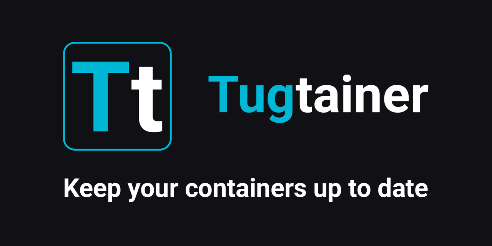

# Tugtainer is a self-hosted app for automating updates of your docker containers



Please be aware that the application is distributed as-is and is not recommended for use in a production environment.

And don't forget about regular backups of important data.

Automatic updates are disabled by default. You can enable only what you need.

## Table of contents:

- [main features](#main-features)
- [deploy](#deploy)
- [private registries](#private-registries)
- [custom labels](./docs/CUSTOM_LABELS.md)
- [hooks](./docs/HOOKS.md)
- [notifications](./docs/NOTIFICATIONS.md)
- [auth](#auth)
- [api](#api)
- [env](#env)
- [check and update](./docs/CHECK_AND_UPDATE.md)
- [healthcheck monitoring](./docs/HEALTHCHECK_MONITOR.md)
- [screenshots](./docs/SCREENSHOTS.md)
- [contributing](./docs/CONTRIBUTING.md)
- [security](./docs/SECURITY.md)

## Main features:

- Web UI with authentication
- Multiple hosts support
- Socket proxy support
- Crontab scheduling
- Notifications to a wide range of services
- Per-container config (check only or auto-update)
- Automatic/manual check and update
- Healthcheck monitoring with auto-restarts and notifications
- Automatic/manual image pruning
- Linked containers support (compose and custom)
- Private registries support
- Basic container control (start, stop, etc.)
- Container detailed info (inspect, logs)

## Deploy:

- ### Quick start

  Use [docker-compose.app.yml](./docker-compose.app.yml) or the following docker commands.

  ```bash
  # create volume
  docker volume create tugtainer_data

  # pull image
  docker pull ghcr.io/quenary/tugtainer:1

  # run container
  # AGENT_SECRET is required. Set a strong, unique shared secret.
  docker run -d -p 9412:80 \
      --name=tugtainer \
      --restart=unless-stopped \
      -e AGENT_SECRET="" \
      -v tugtainer_data:/tugtainer \
      -v /var/run/docker.sock:/var/run/docker.sock:ro \
      ghcr.io/quenary/tugtainer:1
  ```

> [!IMPORTANT]
> Keep in mind that you **cannot update** an **agent** or a **socket-proxy** from within the app because they are used to communicate with the Docker CLI.
> Avoid including these containers in a docker-compose that contains other containers you want to update automatically, as this will result in an error during the update.
> To keep them updated, you can activate "check" only to receive notifications, and recreate them manually or from another tool, such as Portainer.

- ### Remote hosts

  > [!IMPORTANT]
  > Agent host URLs that resolve to private or reserved networks are blocked by default (best-effort check; see the [security policy](./docs/SECURITY.md)).
  > The agent client then connects only to the addresses that passed that check, without replacing the hostname (TLS / virtual hosts stay intact).
  > If your remote agent is on a LAN or Docker network, allow it on the primary instance via **AGENT_ALLOW_NETWORKS** (e.g. `192.168.0.0/24`) and/or **AGENT_ALLOW_ENDPOINTS** (e.g. `10.0.0.5:9413`).
  > See [.env.example](./.env.example).
  > By default, only the built-in agent endpoint `127.0.0.1:8001` is allowed when `AGENT_ENABLED=true`.

  To manage remote hosts from one UI, you have to deploy the Tugtainer Agent.
  To do so, you can use [docker-compose.agent.yml](./docker-compose.agent.yml) or the following docker commands.

  After deploying the agent, in the UI follow Menu -> Hosts, and add it with the respective parameters. The **Agent secret** field should match the **AGENT_SECRET** you've provided for the agent container.

  Backend and agent use HTTP by default. You can put a reverse proxy in front for HTTPS.

  - Public CA (Let's Encrypt, etc.): set the host URL to `https://…`, leave **SSL** on, leave **Custom CA** empty.
  - Private CA or self-signed: paste the CA PEM (or the self-signed certificate) into **Custom CA**, keep **SSL** on. The certificate hostname/SAN must match the URL host.
  - TLS on the agent without a reverse proxy: mount cert/key into the agent container and pass `--ssl-certfile` / `--ssl-keyfile` via `command` (see [docker-compose.agent.yml](./docker-compose.agent.yml)). Paste the corresponding CA in the host settings. The image healthcheck uses `http://localhost:8001` and may fail if uvicorn serves only HTTPS.

  ```bash
  # pull image
  docker pull ghcr.io/quenary/tugtainer-agent:1

  # run container
  # AGENT_SECRET is required. Set a strong, unique shared secret.
  docker run -d -p 9413:8001 \
      --name=tugtainer-agent \
      --restart=unless-stopped \
      -e AGENT_SECRET="" \
      -v /var/run/docker.sock:/var/run/docker.sock:ro \
      ghcr.io/quenary/tugtainer-agent:1
  ```

- ### Socket proxy

  You can use Tugtainer and Tugtainer Agent without mounting the Docker socket directly.

  [docker-compose.app.yml](./docker-compose.app.yml) and [docker-compose.agent.yml](./docker-compose.agent.yml) use this approach by default.

  Manual setup:
  - Deploy socket-proxy e.g. https://hub.docker.com/r/linuxserver/socket-proxy
  - Enable the following environment variables based on the features you want to use:
    - **Base (check feature)**: `CONTAINERS`, `IMAGES`, `POST`, `INFO`, `PING`
    - **Update feature**: `NETWORKS`
    - **Logs feature**: `ALLOW_LOGS`
    - **Container controls (start/stop/restart)**: `ALLOW_START`, `ALLOW_STOP`, `ALLOW_RESTARTS`, `ALLOW_PAUSE`, `ALLOW_UNPAUSE`
  - Set the env var DOCKER_HOST="tcp://my-socket-proxy:port" on the Tugtainer(-agent) container(s);

## Private registries

To use private registries, you have to mount docker config to Tugtainer or Tugtainer Agent, depending on where the container with the private image is located.

- Create the config using one of the methods on the host machine
  - Log into the registry `docker login <registry>`
  - Manually
  ```json
    {
      "auths": {
        "<registry>": {
          "auth": "base64 encoded 'username:password_or_token'"
        }
      }
    }
  ```
- Mount the config to the Tugtainer (Agent) as a read-only volume `-v $HOME/.docker/config.json:/root/.docker/config.json:ro` or in a docker-compose file.
- That's all you need to do, Docker CLI will take care of the rest.

## Auth

The app uses password authorization by default. The password is stored in a file in encrypted form.

Alternatively, you can use an OpenID Connect provider instead of a password.

Auth cookies are not domain-specific and not HTTPS-only. All of this can be configured using env variables.

## API

The backend API is served under the `/api` base path.

- Swagger UI: `/api/docs`
- Redoc UI: `/api/redoc`

### Public endpoints

- `GET /api/public/health`
- `GET /api/public/version`
- `GET /api/public/summary` (requires `ENABLE_PUBLIC_API=true`)
- `GET /api/public/update_count` (requires `ENABLE_PUBLIC_API=true`)
- `GET /api/public/is_update_available` (requires `ENABLE_PUBLIC_API=true`)


## Env:

Most environment variables are optional. **AGENT_SECRET** is required for backend-agent communication. See [.env.example](/.env.example) for a list of vars with descriptions.
