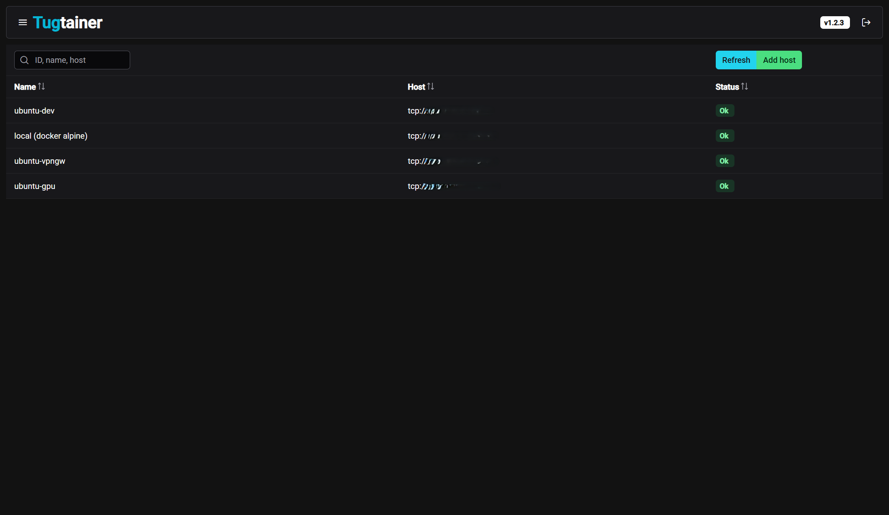
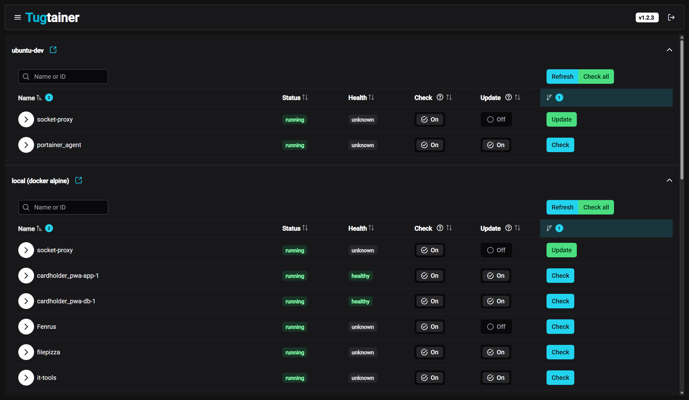
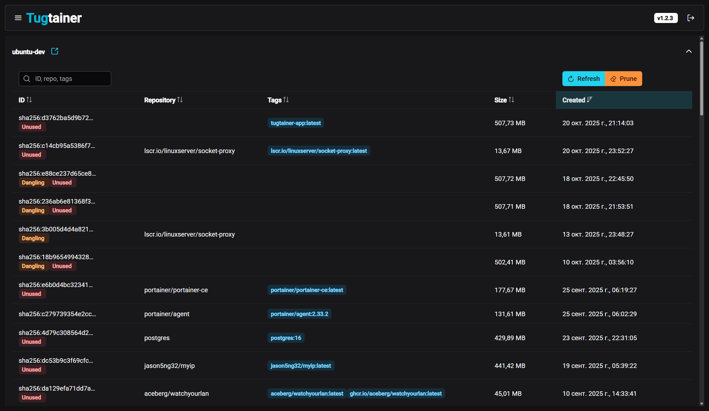
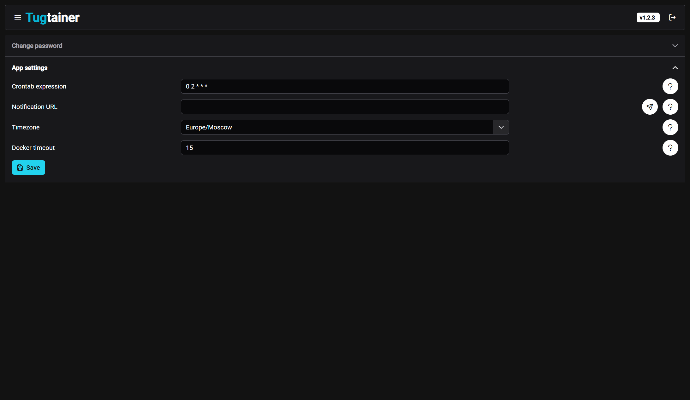

# Tugtainer is a self-hosted app for automating updates of your docker containers

It's like well-known [watchtower](https://github.com/containrrr/watchtower), but with a web UI where you can change most of the settings or view the current state of the containers.

<p align="center">




</p>

Please be aware that the application is distributed as is and is not recommended for use in a production environment.

And don't forget about regular backups of important data.

Automatic updates are disabled by default. You can choose only what you need.

## Main features:

- Web UI with authentication
- Socket proxy support
- Multiple hosts support
- Crontab scheduling
- Notifications to a wide range of services
- Per-container config (check only or auto-update)
- Manual check and update
- Automatic/manual image pruning
- Compose support (sort of, read Check/update section)

## Deploy:

- ### Quick start

  Use [docker-compose.app.yml](./docker-compose.app.yml) or following docker commands.

  ```bash
  # create volume
  docker volume create tugtainer_data

  # pull image
  docker pull quenary/tugtainer:latest

  # run container
  docker run -d -p 9412:80 \
      --name=tugtainer \
      --restart=unless-stopped \
      -v tugtainer_data:/tugtainer \
      -v /var/run/docker.sock:/var/run/docker.sock:ro \
      quenary/tugtainer:latest
  ```

- ### Remote hosts

  To manage remote hosts from one UI, you have to deploy the Tugtainer Agent.
  To do so, you can use [docker-compose.agent.yml](./docker-compose.agent.yml) or following docker commands.

  After deploying the agent, in the UI follow Menu -> Hosts, and add it with the respective parameters.

  Remember that the machine with the agent must be accessible for the primary instance.

  Don't forget to change **AGENT_SECRET** variable. It is used for backend-agent requests signature.

  Backend and agent use http to communicate, so you can utilize reverse proxy for https.

  ```bash
  # pull image
  docker pull quenary/tugtainer-agent:latest

  # run container
  docker run -d -p 9413:8001 \
      --name=tugtainer-agent \
      --restart=unless-stopped \
      -e AGENT_SECRET="CHANGE_ME!"
      -v /var/run/docker.sock:/var/run/docker.sock:ro \
      quenary/tugtainer-agent:latest
  ```

- ### Socket proxy

  You can use Tugtainer and Tugtainer Agent without direct mount of docker socket.

  [docker-compose.app.yml](./docker-compose.app.yml) and [docker-compose.agent.yml](./docker-compose.agent.yml) use this approach by default.

  Manual setup:

  - Deploy socket-proxy e.g. https://hub.docker.com/r/linuxserver/socket-proxy
  - Enable at least **CONTAINERS, IMAGES, POST, INFO, PING** for the **check** feature, and **NETWORKS** for the **update** feature;
  - Set env var DOCKER_HOST="tcp://my-socket-proxy:port" to the Tugtainer(-agent) container(s);

## Check/update process:

- ### Groups

  Every check/update process performed by a group of containers. It's not some fancy term, but just that some containers will be grouped together. For now, this only applies to the valid compose projects. Containers with the same _'com.docker.compose.project'_ and _'com.docker.compose.project.config_files'_ label will be grouped and processed together. Otherwise, there will be a group of one container. In future, i plan to add custom dependency label or an UI setting to link containers together (even if they are not in the same project).

- ### Actual process

  - **Image pull** performed for containers marked for **check**;
  - If there are a **new image** for any group's container and it is **marked for auto-update**, the update process begins;
  - After that, all containers in the group are stopped in **order from most dependent**;
  - Then, **in reverse order** (from most dependable):
    - Updatable containers being recreated and started;
    - Non-updatable containers being started;

- ### Scheduled:

  - For each **host defined in the UI**, the check/update process starts at time specified in the settings;
  - All containers of the host are distributed among **groups**;
  - Each container in the group receives an **action based on your selection in the UI** (check/update/none);
  - _Actual process_

- ### Click of check/update button:
  - **The container** (and **possible participants** from compose) added to a group;
  - **The container** receives an action based on the button you've clicked (check or update);
  - **Other possible participants** receives an **action based on your selection in the UI**. For instance, if you've clicked the update button for container 'a', and container 'b' is **participant** and it is **marked for auto-update** and there is **new image** for it, **it will also be updated**. Otherwise, **participant** will not be updated even if there is a new image for it.
  - _Actual process_

## Env:

Environment variables are not required, but you can still define some. There is [.env.example](/.env.example) containing list of vars with description.

## Develop:

- angular for frontend
- python for backend and agent
- there are a readme files in respective directories
- run install.sh to prepare environment
- clear python cache: find . | grep -E "(/**pycache**$|\.pyc$|\.pyo$)" | xargs rm -rf

### TODO:

- add unit tests
- filter cont in notification (dont notify already notified)
- Dozzle integration or something more universal (list of urls for redirects?)
- Swarm support?
- Try to add release notes (from labels or something)
- Remove unused deps
- Do not update stopped containers
