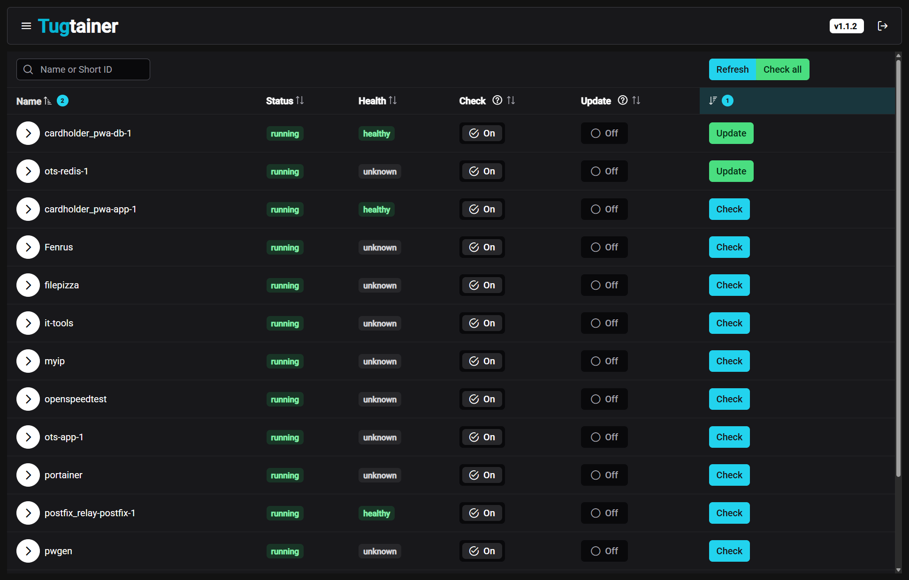
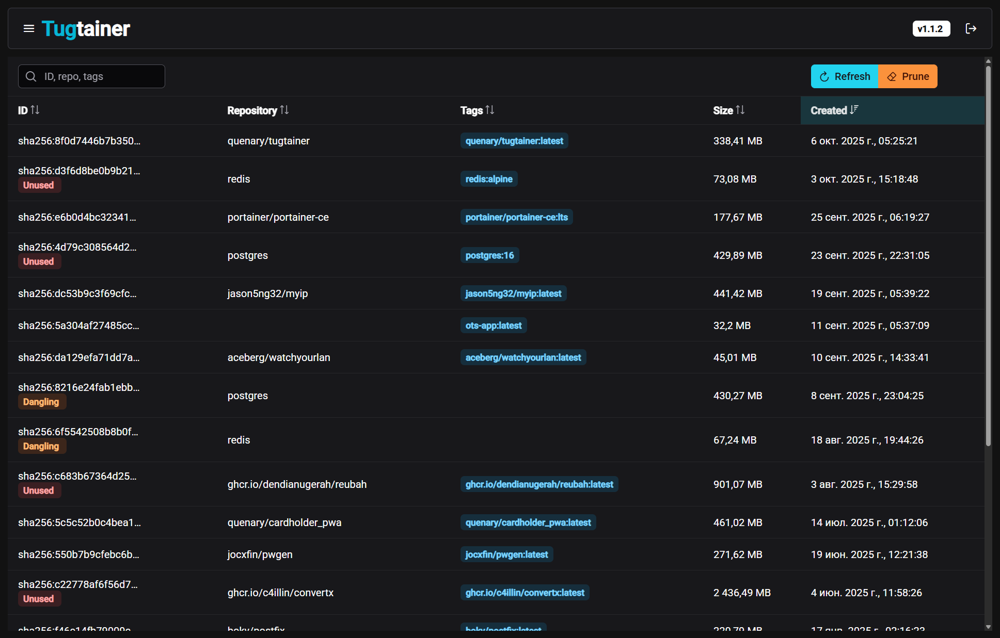
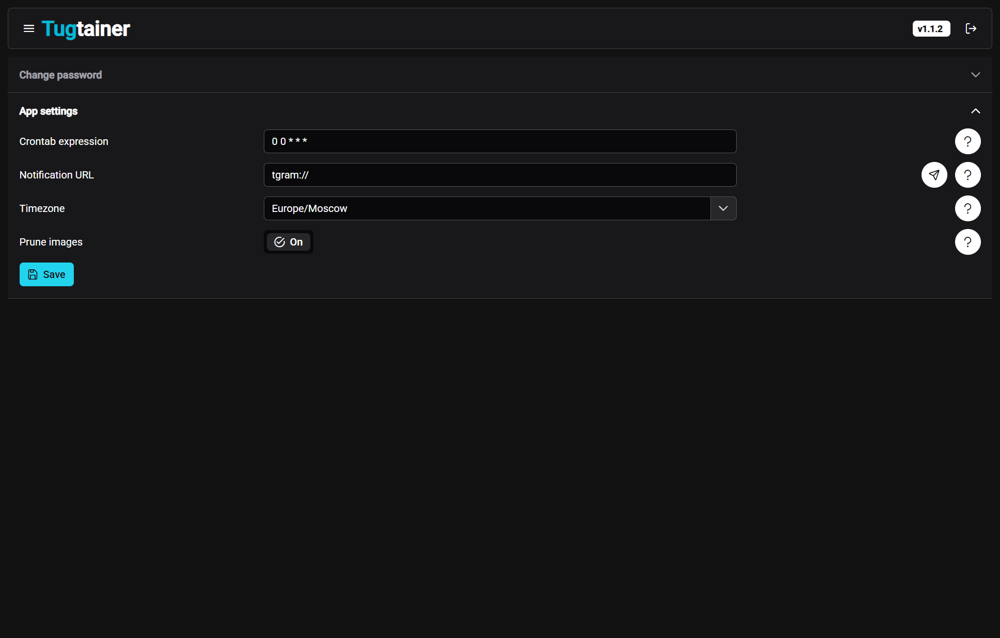

# Tugtainer is a self-hosted app for automating updates of your docker containers

It's like well-known [watchtower](https://github.com/containrrr/watchtower), but with a web UI where you can change most of the settings or view the current state of the containers.

<p align="center">



</p>

Please be aware that the application is distributed as is and is not recommended for use in a production environment.

Automatic updates are disabled by default. You can choose only what you need.

## Main features:

- Crontab expression scheduling
- Notifications for a wide range of services
- Per container selection
- Manual check and update
- Web UI with auth
- Auto/manual image prune

## Deploy:

```
# create volume
docker volume create tugtainer_data

# pull image
docker pull quenary/tugtainer:latest

# run container
docker run -d -p 9412:80 \
    --name=tugtainer \
    --restart=unless-stopped \
    -v tugtainer_data:/tugtainer \
    -v /var/run/docker.sock:/var/run/docker.sock \
    quenary/tugtainer:latest
```

## Env:

Environment variables are not required, but you can still define some. There is [.env.example](/.env.example) containing list of vars with description.

## Develop:

- angular for frontend
- python for backend
- there are a readme files in corresponding directories

### TODO:

- add unit tests
- filter cont in notification (dont notify already notified)
